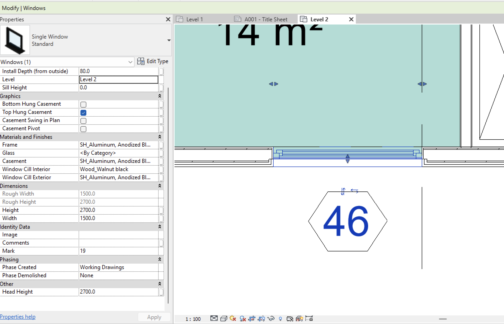

# Read and Write Parameters

Before starting, make sure you have installed <u>[Revit Python Shell](https://github.com/architecture-building-systems/revitpythonshell/releases)</u>. Please note that Revit Python Shell already has imported all the necessary classes and objects from the Revit API, so you can run directly in your RPS Editor all the code used in this story.

## API Reference
- [Element](https://www.revitapidocs.com/2022/eb16114f-69ea-f4de-0d0d-f7388b105a16.htm)
- [Parameter](https://www.revitapidocs.com/2022/333ff41b-e6a7-d959-60bf-c3bfae495581.htm)
- [Definition](https://www.revitapidocs.com/2022/6b9e250f-c8ea-daa4-30ea-b3036df5b24d.htm)
- [Transaction](https://www.revitapidocs.com/2022/308ebf8d-d96d-4643-cd1d-34fffcea53fd.htm)

## Getting parameters from Revit elements
Almost any Revit object inherits from Element, because of that we have access to it’s method and properties.
For convenience, in these examples we are going to use the active view in the document as element to read and write the parameters. However, you can get from the document any other element. Please, refer to [this post](select_elements.md) to know how to do it.


### All parameters from element
We can get all the parameters using the element property “Parameters”.

``` py linenums="1"
element = doc.ActiveView

for parameter in element.Parameters:
    # The property "Definition" of the parameter give us the Name
    parameter_name = parameter.Definition.Name
    print(parameter_name)
```

### Getting parameter by Name
Using the [“LookupParameter”](https://www.revitapidocs.com/2022/4400b9f8-3787-0947-5113-2522ff5e5de2.htm) method. This return may be “None” if there is no matching parameter. If there are multiple matching parameters the first one found is returned.

``` py linenums="1"
element = doc.ActiveView

parameter_to_find = "Drawn By"

parameter = element.LookupParameter(parameter_to_find)

# we ALWAYS need to check if the parameter exists
if parameter is not None:
    print(f'"{parameter_to_find}" parameter was found')
else:
    print(f'"{parameter_to_find}" parameter was not found')
```

Using the [“GetParameters”](https://www.revitapidocs.com/2022/0cf342ef-c64f-b0b7-cbec-da8f3428a7dc.htm) method.This will return a list will al the parameters matching that name. If not find any parameters, the list will be empty.

``` py linenums="1"
element = doc.ActiveView

parameter_to_find = "Drawn By"

parameters = element.GetParameters(parameter_to_find)

for parameter in parameters:
     print(parameter.Definition.Name)
```

Using the [“ParametersMap”](https://www.revitapidocs.com/2022/82c45482-a018-32e4-d8e5-9751e10ffeb9.htm) property.

``` py linenums="1"
import Autodesk.Revit.Exceptions as rex

element = doc.ActiveView

parameter_to_find = "Drawn By"

try:
    parameter = element.ParametersMap[parameter_to_find]
    print(parameter.Definition.Name)
except rex.InvalidOperationException:
    print(f'Could not find parameter "{parameter_to_find}"')
```

### Getting the value from a parameter

In this example we are going to use a simple window to get the parameters. Let’s grab the “Width” parameter and get some information.



``` py linenums="1"
window_id = uidoc.Selection.GetElementIds()[0] # Getting the first id of the list

window = doc.GetElement(window_id)

width_parameter = window.LookupParameter("Width")

print(width_parameter.StorageType) # This will print "Double" which is a number

# Checking the units
unit_type_id = width_parameter.GetUnitTypeId()
print(unit_type_id.TypeId) # This will print "autodesk.unit.unit:millimeters-1.0.1"

# Getting the value as a string with the correct units
value_string = width_parameter.AsValueString()
print(value_string) # This will print 1500

# To have the actual number we need to convert it to a number in python
numeric_value = float(value_string)

# Getting the numeric value contained in the parameter
internal_numeric_value = width_parameter.AsDouble()
print(internal_numeric_value) # This will print "4.92125" because Revit internal units are imperial.
```

To know more about the storage types, check [this link](https://www.revitapidocs.com/2022/3dbebcb8-792b-a3dd-fe63-faaa05704f3c.htm).

When you get a numeric value take in mind that Revit is giving that value in internal units. Revit has some utilities to deal with this kind of situation. We can convert that value in the following way, continuing with the previous example:

``` py linenums="1"
desired_value = UnitUtils.ConvertFromInternalUnits(internal_numeric_value, unit_type_id)
print(desired_value) # This will print "1500.0"
```

## Setting a Parameter value
To change a parameter in Revit, we need to start a transaction. Actually, we need to start a transaction to make any change in the Revit database.

``` py linenums="1"
window_id = uidoc.Selection.GetElementIds()[0] # Getting the first id of the list

window = doc.GetElement(window_id)

width_parameter = window.LookupParameter("Width")

new_value = 2000

new_internal_value = UnitUtils.ConvertToInternalUnits(new_value, unit_type_id)

transaction = Transaction(doc)

# Starting transaction
transaction.Start("Change window width")

try:
    width_parameter.Set(new_internal_value)
    transaction.Commit()
except:  # Don't do this, specify the type of the exception. I'm doing this for convenience.
    # We need to ensure we finish the transaction
    transaction.RollBack()
```

## Real world example
In many real-world projects, we often encounter the need to make changes, which can sometimes be time-consuming. For instance, in this particular scenario, we will demonstrate how to add a prefix to the parameter “Sheet Number” in all sheets within the model where the Sheet Name contains a specific word (in this case: “arch”).

``` py linenums="1"
prefix = "PR"
word = "arch"

# Getting all sheets
sheets = FilteredElementCollector(doc).OfClass(ViewSheet).WhereElementIsNotElementType()

transaction = Transaction(doc)

# Starting transaction
transaction.Start("Add prefix to sheet number")

try:
    for sheet in sheets:
        # Getting sheet name
        sheet_name_parameter = sheet.LookupParameter("Sheet Name")
        sheet_name = sheet_name_parameter.AsString() # The sheet name is a string (a word in non programming terms)
    
        # Checking if the sheet name contains the word "arch"
        # I'm using the method "lower" in python to compare lowercase with lowercase because we are doing case-insensitive string comparison
        if word in sheet_name.lower():
            sheet_number_parameter = sheet.LookupParameter("Sheet Number")
            sheet_number = sheet_number_parameter.AsString()
            new_sheet_number = f"{prefix}-{sheet_number}"
            sheet_number_parameter.Set(new_sheet_number)

    transaction.Commit()
except:  # Don't do this, specify the type of the exception. I'm doing this for convenience.
    # We need to ensure we finish the transaction
    transaction.RollBack()
```